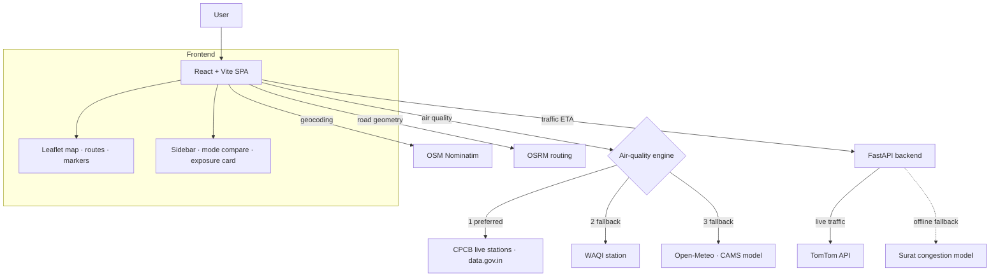

# 🚍 TransitOptima — Surat Smart Transport Optimizer

> Plan a trip in Surat and compare **BRTS, shared auto-rickshaw, and private car** side-by-side on **time, cost, CO₂, and — uniquely — the air pollution you'd personally breathe** along the way.

TransitOptima is a full-stack decision-support tool for urban mobility. It combines real road-network routing, traffic-aware ETAs, graph-based public-transit journey planning, and a live multi-source air-quality engine to answer a question most trip planners ignore: *"Which way is not just fastest or cheapest, but healthiest?"*

**🔗 Live demo:** **[surat-transit-optimiser-3e9j.vercel.app](https://surat-transit-optimiser-3e9j.vercel.app/)**

<!-- TODO: drop a screenshot or GIF here — it is the single most valuable thing for reviewers -->
<!--  -->

---

## ✨ Highlights

What makes this more than a map demo:

- **🫁 Personal pollution exposure per mode** — not just ambient AQI, but how much PM2.5 *you* inhale, adjusted for your travel microenvironment (an open auto-rickshaw exposes you to ~3× the dose of an enclosed AC car) and trip duration. Pollution becomes a real reason to pick one mode over another.
- **🛰️ Honest, multi-source air quality** — a graceful hierarchy: **live CPCB ground sensors (data.gov.in)** → **WAQI station** → **Copernicus CAMS model**. The UI always states which source it used and how far the nearest sensor is — no precise-looking numbers pretending to be measured when they're modelled.
- **🗺️ Real road-following routes** — BRTS and walking legs are snapped to the actual street network via OSRM, not drawn as straight lines.
- **🚌 Graph-based BRTS journey planning** — Dijkstra over a station graph with transfers and first/last-mile walking legs.
- **🚦 Traffic-aware ETAs** — live TomTom traffic via a backend proxy, falling back to an on-device hour-by-hour Surat congestion model with Tapi-bridge queueing.
- **🎨 Official US-EPA AQI guideline** — exact 6-band classification, colours, and health advice.

---

## 🧩 Architecture



**Why a hybrid air-quality engine?** Surat has **no WAQI station** (the nearest is ~50 km away in Ankleshwar, an industrial town) — so WAQI-only would show the wrong city's air. But **data.gov.in does expose live CPCB sensors inside Surat** (Katargam, Science Center). The engine prefers those, interpolates between them along the path (inverse-distance weighting), and only falls back to the regional CAMS model when no sensor is nearby — always labelling the source honestly.

---

## 🛠️ Tech Stack

| Layer | Tools |
|-------|-------|
| Frontend | React 18, Vite 5, React-Leaflet / Leaflet 1.9 |
| Backend | FastAPI (Python), Uvicorn |
| Mapping & data | OpenStreetMap tiles, Nominatim (geocoding), OSRM (routing) |
| Air quality | CPCB via data.gov.in, WAQI (aqicn.org), Open-Meteo / Copernicus CAMS |
| Traffic | TomTom Traffic API (+ on-device fallback model) |
| Testing | Node built-in test runner (`node:test`) |

---

## 📁 Project Structure

```text
smart-transport-optimizer/
├── index.html
├── package.json
├── vite.config.js
├── .env.example                # copy to .env and add your keys
├── src/
│   ├── App.jsx                 # global state, trip planning, sidebar UI
│   ├── App.css
│   ├── components/
│   │   ├── MapView.jsx         # map, markers, road-following route polylines, legend
│   │   └── ExposureCard.jsx    # ambient + per-mode pollution exposure
│   └── utils/
│       ├── geocodingService.js # Nominatim place search (Surat-biased)
│       ├── osrmService.js      # snaps waypoints to road geometry
│       ├── graphUtils.js       # BRTS station graph + Dijkstra + nearest station
│       ├── transitDataService.js
│       ├── recommendationEngine.js
│       ├── fareEngine.js
│       ├── googleMapsService.js# traffic-aware ETA (backend + fallback)
│       ├── airQualityService.js# hybrid AQI engine + per-mode exposure
│       ├── cpcbService.js      # live CPCB stations (data.gov.in)
│       └── waqiService.js      # WAQI nearest-station + EPA conversions
├── backend/
│   ├── app/
│   │   ├── main.py             # FastAPI app (see API endpoints below)
│   │   ├── schemas.py          # Pydantic request/response models
│   │   └── services/           # geo, graph (Dijkstra), fares, traffic
│   ├── requirements.txt
│   └── .env.example            # TOMTOM_API_KEY
└── tests/                      # node:test unit tests
    ├── epaConversion.test.js
    └── exposure.test.js
```

---

## 🚀 Getting Started

### Prerequisites
- Node.js 18+ and npm
- (Optional) Python 3.10+ for the backend traffic proxy

### 1. Clone & install
```bash
git clone <your-repo-url>
cd smart-transport-optimizer
npm install
```

### 2. Configure environment
```bash
cp .env.example .env
```
Then edit `.env` (see [Environment Variables](#-environment-variables)). The app runs **without any keys** — air quality falls back to the free CAMS model and traffic to the on-device model — but keys unlock live sensor and traffic data.

### 3. Run the frontend
```bash
npm run dev        # http://localhost:5173
```

### 4. (Optional) Run the backend
```bash
cd backend
python -m venv .venv && .venv\Scripts\activate   # Windows
pip install -r requirements.txt
uvicorn app.main:app --reload --port 8000
```
Interactive API docs are then served at `http://localhost:8000/docs`.

**Backend API**

| Method & path | Purpose |
|---------------|---------|
| `GET /api/health` | Liveness check |
| `GET /api/stations`, `/api/routes`, `/api/profiles` | BRTS network + passenger profiles |
| `GET /api/nearest-station?lat=&lng=` | Snap a coordinate to the nearest BRTS station |
| `POST /api/fare` | Distance-slab fare calculation |
| `POST /api/multimodal-route` | Graph-based BRTS journey (walk + ride + transfers) |
| `POST /api/traffic` | Traffic-aware ETA (TomTom, else Surat congestion model) |
| `POST /api/recommendations` | Ranked mode comparison |

### 5. Run the tests
```bash
npm test           # 13 unit tests (AQI math, exposure factors, classification)
```

### 6. Production build
```bash
npm run build && npm run preview
```

---

## 🔐 Environment Variables

Set these in `.env` (frontend, Vite) — **never commit real keys**; `.env` is gitignored.

| Variable | Required | Purpose |
|----------|----------|---------|
| `VITE_WAQI_TOKEN` | Optional | WAQI air-quality token — free from [aqicn.org](https://aqicn.org/data-platform/token/). If absent, WAQI is skipped. |
| `VITE_DATAGOV_KEY` | Optional | data.gov.in key for live CPCB stations — free from [data.gov.in](https://data.gov.in). A shared sample key is bundled for light use. |

Backend keys (e.g. `TOMTOM_API_KEY`) go in `backend/.env` — see `backend/.env.example`.

---

## 🔬 Data & Methodology

- **Air Quality Index** — classified on the official **US-EPA** 6-band scale (Good → Hazardous). PM2.5 sub-indices are converted to/from µg/m³ using the EPA piecewise-linear breakpoints.
- **Personal exposure** — `inhaled PM2.5 = ambient × mode factor × breathing rate × trip time`. Mode factors (literature-informed, tunable in `airQualityService.js`): private car `0.5`, BRTS `~0.7–0.9` (time-blended with exposed walk legs), open auto `1.5`.
- **Path interpolation** — when multiple CPCB stations are available, AQI along the route is estimated by inverse-distance-squared weighting, so in-city sensors dominate and distant ones act only as a safety net.

> **Honest limitations:** CPCB coverage in Surat is two stations, so intra-city spatial variation is limited; the CAMS fallback is a ~40 km model grid. Mode-exposure factors are evidence-informed defaults, not measured for Surat's specific vehicles. These are clearly labelled in the UI.

---

## 🗺️ Roadmap

- [ ] Departure-time optimizer (best hour for combined speed + clean air, using hourly traffic + AQI)
- [ ] Shareable trip URLs
- [ ] Mobile-responsive layout pass
- [ ] Land-use-regression / ML model for hyperlocal AQI once more sensor data is available

---

## 🙏 Acknowledgements

OpenStreetMap & Nominatim · OSRM · Copernicus CAMS / Open-Meteo · WAQI (aqicn.org) · CPCB / data.gov.in · TomTom. Built as an urban-mobility prototype for Surat, Gujarat.
